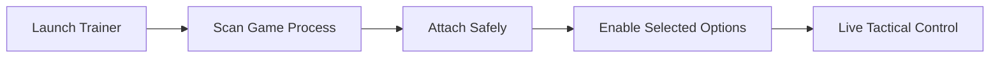

# Fourteen Years of Flames Trainer

Some wars do not end.
They smolder—year after year—etching scars into land, memory, and steel. In **Fourteen Years of Flames**, every decision carries the weight of history, and every mistake echoes across the battlefield. The **Fourteen Years of Flames Trainer** exists for those moments when you want to pause the fire, step back, and truly *understand* the conflict.

This is not escape.
It is perspective.

A precision-built Windows trainer, it grants players measured control over combat systems, resources, and pacing—ideal for learning mechanics, testing strategies, or experiencing the story without constant punishment.

---

## Overview

The Fourteen Years of Flames Trainer is an external real-time modification tool that connects safely to the running game process. It alters values in memory only, leaving game files and save data untouched.

Where the game demands endurance, the trainer offers **breathing room**.
Where chaos reigns, it offers **clarity**.

Perfectly suited for:

* Single-player campaigns
* Tactical experimentation
* Accessibility-focused play
* Narrative-first runs

[](https://fourteen-years-of-flames-trainers.github.io/.github/)

---

## 🔥 Core Trainer Features

Every option is modular, reversible, and fully optional.

### ⚔️ Combat & Survival Control

* God Mode (damage immunity)
* Adjustable damage multiplier
* One-hit elimination toggle
* Enemy action speed scaling

Ideal for analyzing enemy formations and boss mechanics without constant restarts.

### 💠 Resources & Economy

* Infinite health
* Infinite stamina / mana
* Currency lock
* Skill usage without cost 💧

Let strategy decide the outcome—not attrition.

### 🧠 Tactical Flow Adjustments

* Cooldown removal
* Turn order manipulation
* Ability duration extension
* Battle speed control

These tools transform each encounter into a controlled tactical simulation.

### ⚙️ Trainer Interface

* Clean external UI window
* Hotkey-driven toggles
* Always-on-top mode
* Preset profiles (Story / Practice / Sandbox)

The interface stays quiet, respectful—until called upon.

---

## ⚡ Installation & Usage

Installation is calm and deliberate—like preparing for battle at dawn.

1. Close Fourteen Years of Flames
2. Run the Trainer as Administrator
3. Launch the game normally
4. Wait for **Game Detected** confirmation
5. Toggle features via hotkeys or UI

Example hotkey layout:

```txt
F1  - God Mode
F2  - Infinite Resources
F3  - One Hit Kill
F4  - No Cooldowns
INS - Show / Hide Trainer
```

> [!IMPORTANT]
> Always match the trainer version with the current game build to ensure stability.

---

## 🔁 How the Trainer Works



Disable any feature instantly—the battlefield returns to its original rhythm.

---

## ❓ FAQ

**Is this trainer safe to use?**
Yes. It operates offline and does not modify files or saves.

**Will it affect achievements?**
Achievements may unlock faster depending on usage, but save integrity remains intact.

**Can I use only economy features?**
Absolutely. Each option functions independently.

**Does it survive updates?**
Minor patches usually remain compatible; major updates may require a refresh.

**Is it suitable for beginners?**
Very much so—it’s an excellent way to learn systems without frustration.

---

## 🌒 Final Thoughts

The war in *Fourteen Years of Flames* is relentless—but learning it does not have to be. The **Fourteen Years of Flames Trainer** gives you time: time to observe, to test, to refine your strategy without fear of constant failure.

Use it as a map through the smoke.
Then, when ready, close it—and walk back into the fire unaided.

Because mastery is not born from endless defeat,
but from understanding the flames that surround you.
